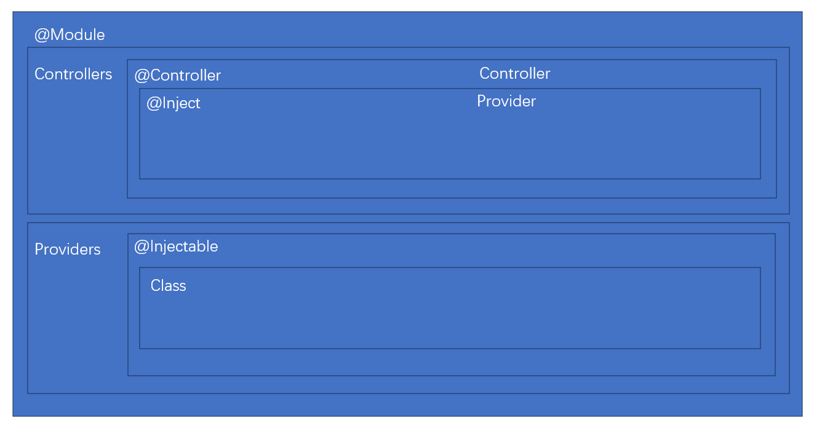

<p align="center">
  <a href="http://nestjs.com/" target="blank"></a>
</p>

[circleci-image]: https://img.shields.io/circleci/build/github/nestjs/nest/master?token=abc123def456
[circleci-url]: https://circleci.com/gh/nestjs/nest

  <p align="center">A progressive <a href="http://nodejs.org" target="_blank">Node.js</a> framework for building efficient and scalable server-side applications.</p>
    <p align="center">
<a href="https://www.npmjs.com/~nestjscore" target="_blank"></a>
<a href="https://www.npmjs.com/~nestjscore" target="_blank"></a>
<a href="https://www.npmjs.com/~nestjscore" target="_blank"></a>
<a href="https://circleci.com/gh/nestjs/nest" target="_blank"></a>
<a href="https://coveralls.io/github/nestjs/nest?branch=master" target="_blank"></a>
<a href="https://discord.gg/G7Qnnhy" target="_blank"></a>
<a href="https://opencollective.com/nest#backer" target="_blank"></a>
<a href="https://opencollective.com/nest#sponsor" target="_blank"></a>
  <a href="https://paypal.me/kamilmysliwiec" target="_blank"></a>
    <a href="https://opencollective.com/nest#sponsor"  target="_blank"></a>
  <a href="https://twitter.com/nestframework" target="_blank"></a>
</p>
  <!--[](https://opencollective.com/nest#backer)
  [](https://opencollective.com/nest#sponsor)-->

## Description

[Nest](https://github.com/nestjs/nest) framework TypeScript starter repository.

## Installation

```bash
$ npm install
```

## Running the app

```bash
# development
$ npm run start

# watch mode
$ npm run start:dev

# production mode
$ npm run start:prod
```

## Test

```bash
# unit tests
$ npm run test

# e2e tests
$ npm run test:e2e

# test coverage
$ npm run test:cov
```

## Support

Nest is an MIT-licensed open source project. It can grow thanks to the sponsors and support by the amazing backers. If you'd like to join them, please [read more here](https://docs.nestjs.com/support).

## Stay in touch

- Author - [Kamil Myśliwiec](https://kamilmysliwiec.com)
- Website - [https://nestjs.com](https://nestjs.com/)
- Twitter - [@nestframework](https://twitter.com/nestframework)

## License

Nest is [MIT licensed](LICENSE).



## 装饰器

- @Module： 声明 Nest 模块
- @Controller：声明模块里的 controller
- @Injectable：声明模块里可以注入的 provider
- @Inject：通过 token 手动指定注入的 provider，token 可以是 class 或者 string
- @Optional：声明注入的 provider 是可选的，可以为空
- @Global：声明全局模块
- @Catch：声明 exception filter 处理的 exception 类型
- @UseFilters：路由级别使用 exception filter
- @UsePipes：路由级别使用 pipe
- @UseInterceptors：路由级别使用 interceptor
- @SetMetadata：在 class 或者 handler 上添加 metadata
- @Get、@Post、@Put、@Delete、@Patch、@Options、@Head：声明 get、post、put、delete、patch、options、head 的请求方式
- @Param：取出 url 中的参数，比如 /aaa/:id 中的 id
- @Query: 取出 query 部分的参数，比如 /aaa?name=xx 中的 name
- @Body：取出请求 body，通过 dto class 来接收
- @Headers：取出某个或全部请求头
- @Session：取出 session 对象，需要启用 express-session 中间件
- @HostParm： 取出 host 里的参数
- @Req、@Request：注入 request 对象
- @Res、@Response：注入 response 对象，一旦注入了这个 Nest 就不会把返回值作为响应了，除非指定 passthrough 为true
- @Next：注入调用下一个 handler 的 next 方法
- @HttpCode： 修改响应的状态码
- @Header：修改响应头
- @Redirect：指定重定向的 url
- @Render：指定渲染用的模版引擎
